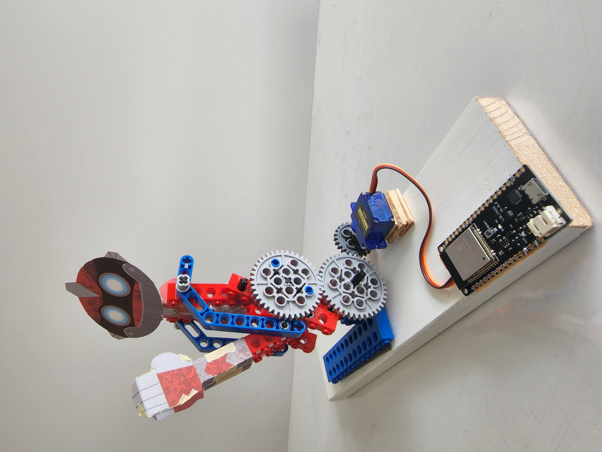
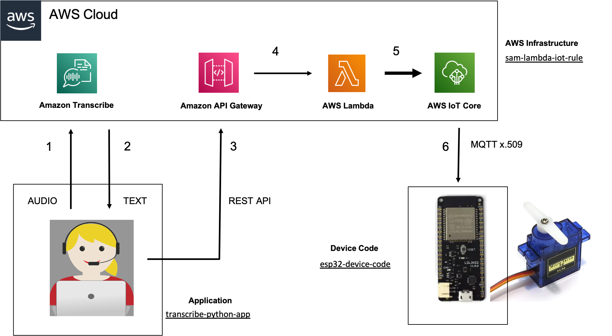

# aws-transcribe-iotcore-lego

## Introduction ##

This project connects AWS Transcribe, a service that converts voice audio to text, to AWS IoT Core, a service used for secure
communications with IoT devices. This means we can control our IoT device with voice commands!!!

The ESP32 device is connected to an SG90 Servo motor, which in turn is used to control the lego rebot. The device can of course do any other action, just replace the robot part of the device code (which is contained in the runRobot() function) if required. For example you could just flash a LED instead of controlling a servo. But thats not as much fun ;-) The ESP32 uses WIFI for connectivity, the local WIFI network access details are stored in the ESP32 secrets.h file. Also stored in secrets.h file are the X.509 certificates used for the secure MQTT communication.

The following code will be provided in this project. The solution contains the following 3 components.

**Device Code** : The [esp32-device-code](esp32-device-code) folder contains the ESP32 device code, an Arduino C program to run on the ESP32 IoT device. The ESP32 device subsribes to a topic to listen for incoming messages. When it receives an incoming message, it performs the neccesary action to move the servo motor. It also publishes messages to an MQTT topic in IoTCore. For this excercise, we only need to receive messasges in the ESP32, feel free to disable the publising if you want. 

**AWS Infrastructure** : This is deployed with AWS Serverless Application Model (SAM). The [sam-lambda-iot-rule](sam-lambda-iot-rule) folder contains the SAM deployment for AWS, see its readme for details on how to deploy. It sets up the complete backend infrastructure to handle both receiving and sending of IoT events. This includes provisioning API Gateway, DynamoDB database, 2 Lambda functions (one for receiving and one for publishing MQTT events), IoT rules and also the necessary policies/roles etc.   

**Application** : The [transcribe-python-app](transcribe-python-app) folder contains the Python script to run on the computer that the users microphone is connected to. It streams the audio up to AWS transcribe using API, and processes the returned text version of the audio. It analises the returned text, and when it detects the key word has been said, it will send a HTTP Post request to the API Gateway which triggers an MQTT event for the ESP32. The ESP32 then turns the servo on to control the robot. 

Here is a digram of the overall architecture. Please read the readme file associated with each of the 3 components.    

  

  
## Setup Instructions ##

As per above, the code is broken down into 3 parts. 

We have device code on the ESP32, which is subscribing to MQTT topic esp32/sub listening for events.  It also publishes a message to MQTT topic esp32/pub every 5 seconds. 

We have to provision all the AWS backend serverless infrastructure, we will use Serverless Application Model (SAM) to do this. 
The AWS Serverless Application Model (SAM) is an open-source framework for building serverless applications. We will use the AWS SAM CLI to create a serverless application that we can package and deploy in the AWS Cloud. SAM contains ALL the AWS infrastructure required for this project. Since AWS Cloud 9 comes with SAM already installed, we use Cloud 9 as our development environment. But you can use any other development environment just ensure it is setup accordingly to support AWS SAM CLI. 

Finally we have the application running on our laptop which has a microphone enabled. This python application requires AWS CLI to be installed on your laptop. I have used Mac OS and terminal. The application streams the live audion to AWS transcribe, and analises the returned text for the approriate command to trigger robot action. 

We will build the complete solution as follows:

First we will handle the ESP32 device code and device setup in AWS IoTCore. We create an IoT thing in IoTCore. We create X.509 certificates for our thing, and also we create the required IAM policies for the thing. We will program the ESP32 device with the necessray code using a simple sketch and Arduino IDE. We will then test that the device is able to send and receive MQTT messages to/from AWS IoTCore. 

Next we will setup the AWS serverless backend infrastructure. We will use SAM to deploy this into our AWS account. 
We will then test it is working using the AWS IoTCore MQTT client to simulate the ESP32 sensor. 

Finally, we will setup the python application and integrate AWS transcribe into the solution, voice commands can trigger an event to the ESP32, which in turn can take an action (turning the servo). 

  

***Step 1***

Configure a thing for the ESP32 in IoTCore. Program the ESP32 device using Arduino IDE. Follw the setup and test instructions from [esp32-device-code](esp32-device-code) to get the ESP32 communicating with IoTCore. 

***Step 2***

Setup the AWS infrastructure. Follow the setup and test instructions from [sam-lambda-iot-rule](sam-lambda-iot-rule) to setup the infrastructure in your AWS account. We use Cloud 9 to do this. 

***Step 3***

Setup and test the python application which converts audio from your microphone into text, and triggers the IoT event towards the ESP32 to move the servo, when the trigger word is detected. Follow the setup and test instructions from [transcribe-python-app](transcribe-python-app).

