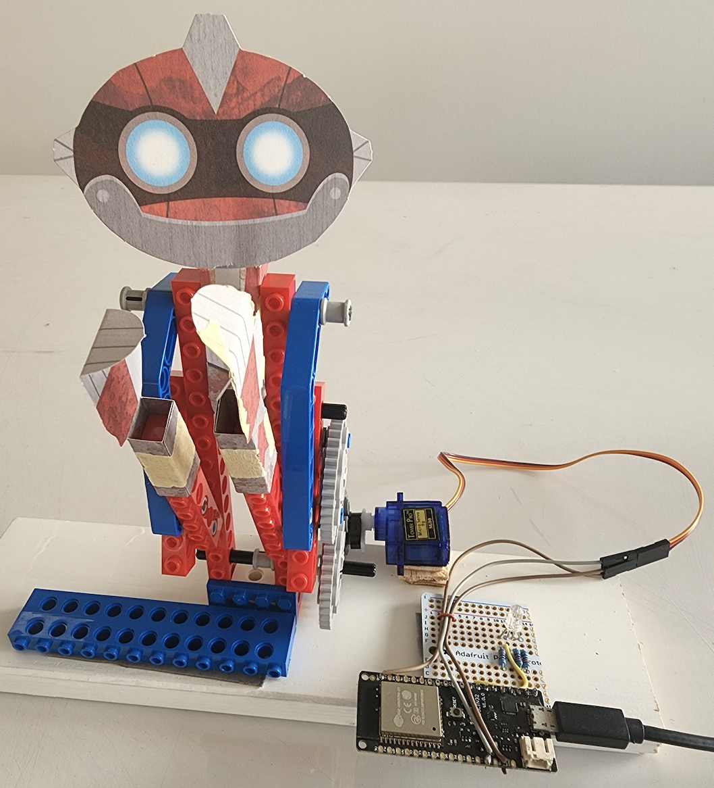
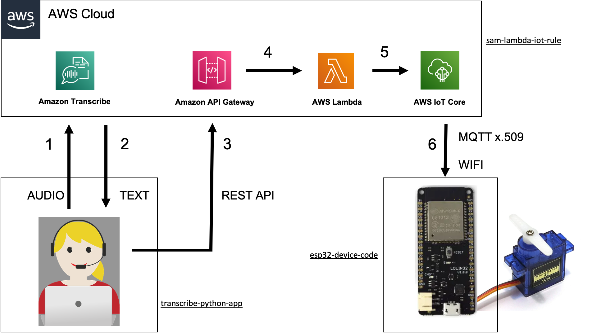

# aws-transcribe-iotcore-lego

This project connects AWS Transcribe, a service that converts voice audio to text, to AWS Core, a service used for secure
communications with Iot devices. This means we can control our IoT device with voice commands. 
The ESP32 device is connected to an SG90 Servo motor, which in turn is used to control the lego rebot. The device can of course do any other action, just replace the robot part of the device code if required. 

The following code will be provided in this project. The solution contains the following 3 components.

Device Code : The **esp32-device-code** folder contains the ESP32 device code, an Arduino C program to run on the ESP32 IoT device. The ESP32 device subsribes to a topic to listen for incoming messages. When it receives an incoming message, it performs the neccesary action to move the servo motor. It also writes to an MQTT topic in IoTCore. 

AWS Infrastructure : This is deployed with Serverless Application Model. The **sam-lambda-iot-rule** folder contains the SAM deployment for AWS, see its readme for details on how to deploy. It sets up the complete backend infrastructure to handle both receiving and sending of IoT events.  

Application : The **transcribe-python-app** folder contains the Python script to run on the computer that the users microphone is connected to. It streams the audio up to AWs transcribe using API, and processes the returned text version of the audio. When it determines 

Here is a digram of the overall architecture. Please read the readme file associated with each of the 3 components. 

