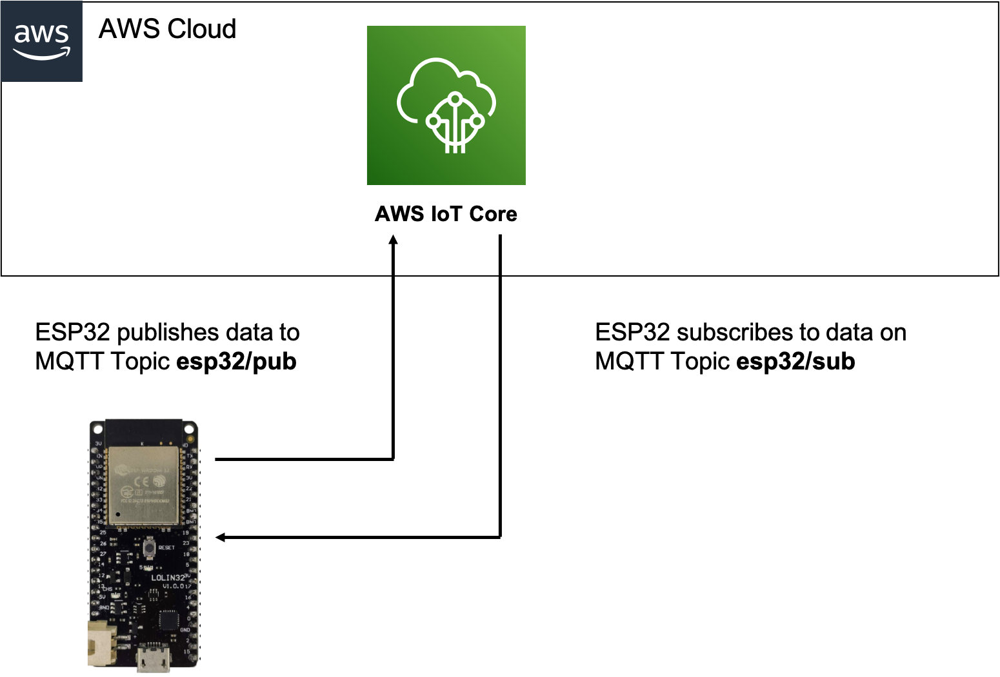
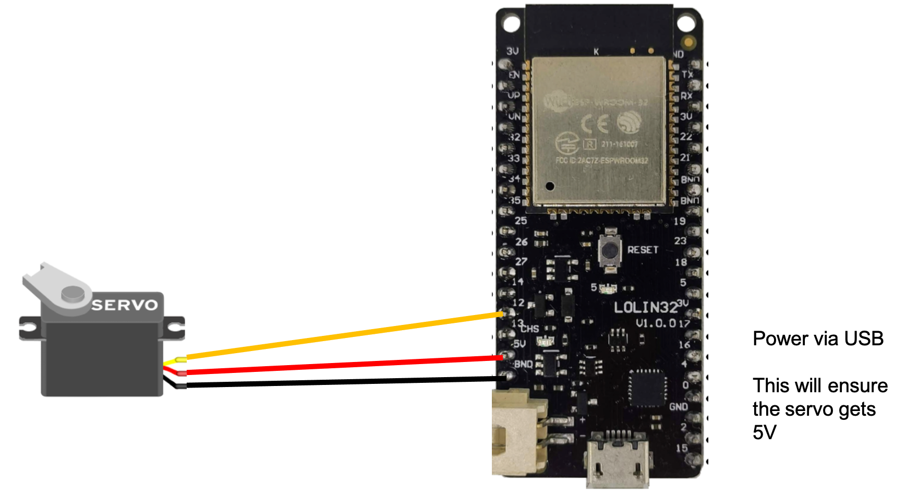
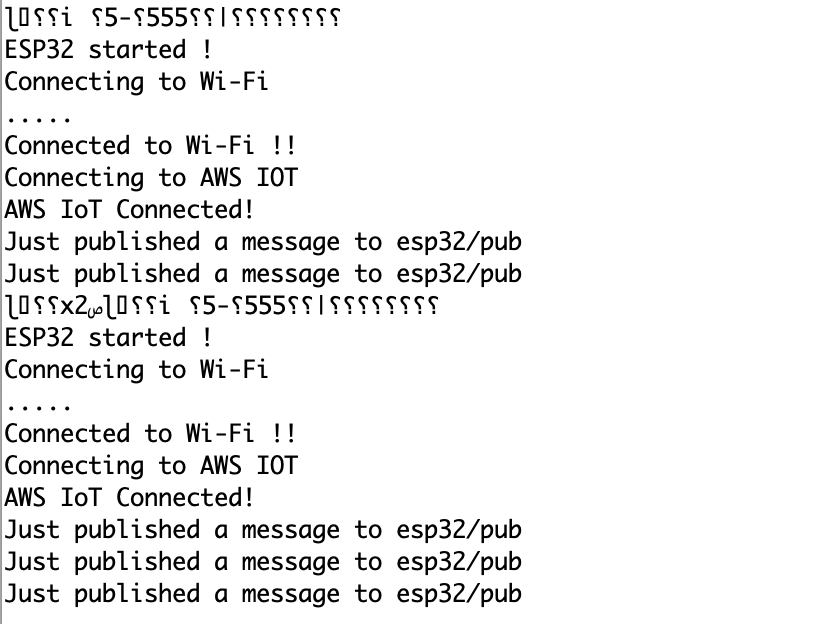
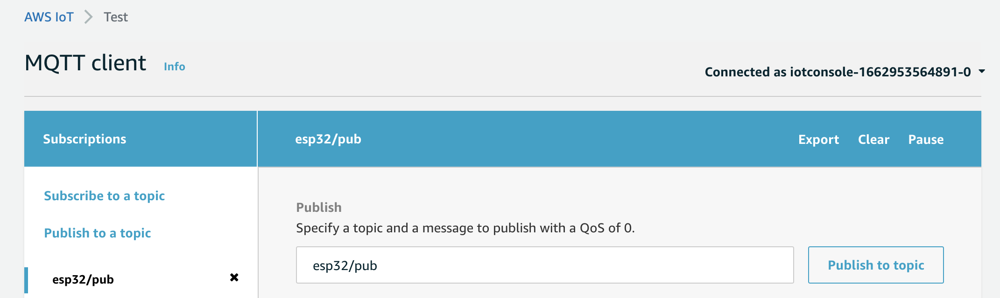
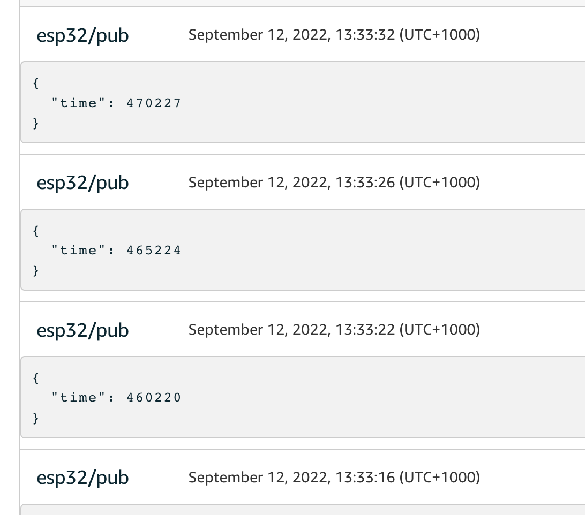
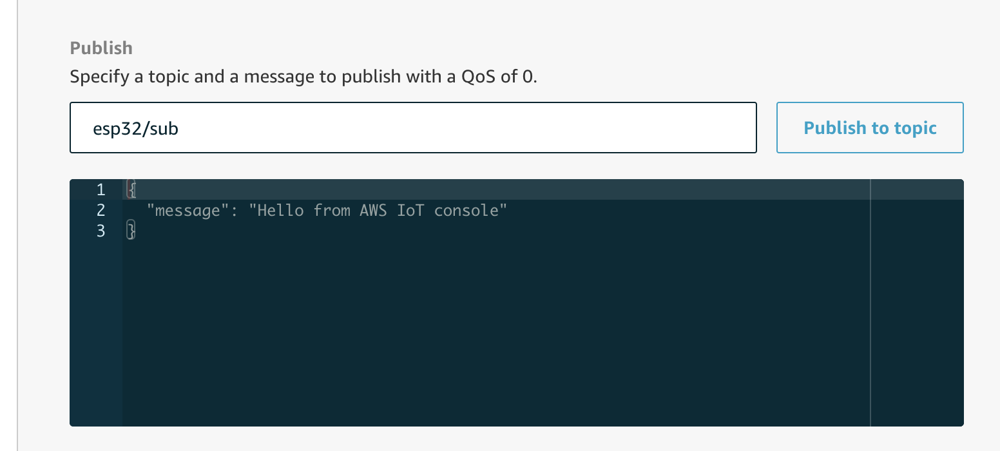
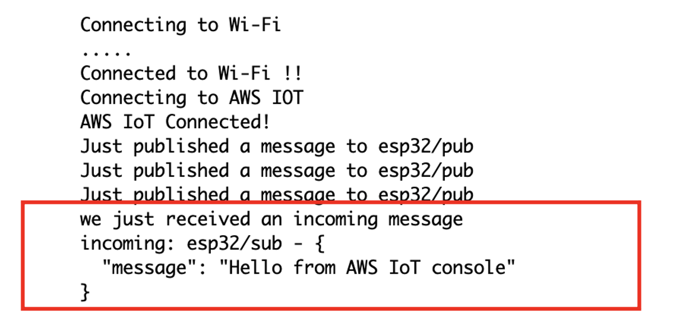

## Connecting ESP32 to AWS IoTCore ##


### Solution overview ### 

To setup an IoT device, in this case the ESP32, to communicate securely with AWS IoTCore, follow the steps shown below. This involves the following steps.

- Create an AWS IoT device in AWS IoTCore. 
- Setup the Arduino IDE for ESP32
- Program the ESP32 with the device code
- Monitor and test ESP32 can send and receive data from IoTCore. 

<br/>


After completing this, we will be able to send and receive data from the ESP32 to/from AWS IoT Core. 

<br/>

### Step 1  Creating an AWS IoT device ### 


In the AWS IoT Core console, go to Manage -> Things

Choose "Create Things"

Choose "Create a single thing"

Under "Specify thing properties" give the thing a name, for example ESP32-00001. Leave the remaining values set to their default. Click "Next".

Under "Configure device certificate" select "Auto-generate a new certificate" and click "Next".

Under "Attach policies to certificate" select create a new policy. 


Use this JSON for the policy and update REGION and ACCOUNT_ID with your region (example = ap-southeast-2) and your account ID (example = 501XXXXXX449).
Paste this JSON into the policy. Ensure the thing name (ESP32-00001) is correct and reflects the name of the thing you created. For more information on securing devices, see AWS IoT Policies.

```json
{
  "Version": "2012-10-17",
  "Statement": [
    {
      "Effect": "Allow",
      "Action": "iot:Connect",
      "Resource": "arn:aws:iot:REGION:ACCOUNT_ID:client/ESP32-00001"
    },
    {
      "Effect": "Allow",
      "Action": "iot:Subscribe",
      "Resource": "arn:aws:iot:REGION:ACCOUNT_ID:topicfilter/esp32/sub"
    },
	{
      "Effect": "Allow",
      "Action": "iot:Receive",
      "Resource": "arn:aws:iot:REGION:ACCOUNT_ID:topic/esp32/sub"
    },
    {
      "Effect": "Allow",
      "Action": "iot:Publish",
      "Resource": "arn:aws:iot:REGION:ACCOUNT_ID:topic/esp32/pub"
    }
  ]
}
```

Click Create Policy

Go back to the "Attach policies to certificate" screen, and select the Policy you just created.

Click "Create Thing"

On the "Download certificates and keys" you must download the certificates. Download and save them somewhere secure, as they will be used when programming the ESP32 device. You will need the Public key file, Private key file and Amazon Root CA 1.

Click "Done"

You will see Under Manage-> Things that the new thing has been created. You will see that it has a Certificate attached. Click on the Certificate and you will see the Policy you created attached. 

Congradulations, the ESP32 device has been provisioned into IoT Core.

### Step 2  Connect Servo to ESP32 (optional) ### 

If you want to connect to lego, you will need a servo motor. The following diagram shows how this is wired up to the ESP32. 
I have used the Wemos Lolin32 dev board, but you can use any ESP32 dev board, just update the arduino program to reflect the pin you use to drive the servo. 



Connect the servo control to GPIO 12. Connect servo positive to 5v output on ESP32 dev board. Connect servo ground to ground on ESP32 dev board. 
This assumes you are powering the dev board via micro usb cable. With batteries the 5V output may not be guaranteed, so you may require additonal circuitry. 
Note: You can leave out the Servo and do something else, for example flash a LED. You only need to update the code in the [runRobot()](esp32code.ino) function in the main arduino program file. 

### Step 2  Setup the Arduino IDE for ESP32 ### 


Download the Arduino installer for the desired operating system.

Start Arduino and open the Preferences window.

For Additional Board Manager URLs, add

https://dl.espressif.com/dl/package_esp32_index.json.

Choose Tools, Board, Boards Manager.

Search esp32 and install the latest version by Espressif Systems.

Choose Sketch, Include Library, Manage Libraries.

Search MQTT, and install the latest version by Joel Gaehwiler.
[https://www.arduino.cc/reference/en/libraries/mqtt/](https://github.com/256dpi/arduino-mqtt)


Repeat the library installation process for ArduinoJson.
[https://github.com/bblanchon/ArduinoJson/](https://github.com/bblanchon/ArduinoJson)

If you are using the servo, install this library. Download the zip file and under Sketch-> Include library -> Add .ZIP file. 
https://github.com/madhephaestus/ESP32Servo/tree/master/examples


The Arduino IDE is now installed and configured with all the board definitions and libraries needed for this walkthrough.


###  Step 3  Program the ESP32 with the device code ### 

We will connect the ESP32 to Arduino IDE using USB serial cable. We also use this USB cable to power the ESP32. 
You will need to install the appropriate USB driver for your OS. 

1) Install the required serial USB drivers for your device. Some boards use different USB/FTDI chips for interfacing.There are plenty of tuorials on the net to help with this. 
	
2) Open the Arduino IDE and choose File, New to create a new sketch.

3) Copy the main .ino file from this repository, esp32code.ino and open this in Arduino. Save it.

4) Copy the secrets.h from this repository, place into same directory as esp32code.ino

5) Update the secrets.h file. You will need to add the following:


**THINGNAME**	(Set to the name of the thing created in IoT Core)
	
**WIFI_SSID**	(Set to the name of the WIFI network the ESP32 will connect to. The network name should not include spaces or special chars)
	
**WIFI_PASSWORD** (Set to the WIFI password)
	
**AWS_IOT_ENDPOINT** (Set to value shown in IoT Core -> Settings. It will look like this (a1XXXXXXXXXX1e-ats.iot.ap-southeast-2.amazonaws.com)

Paste the following 3 certs which you downloaded earlier into secrets.h 

**Amazon Root CA 1**

**Device Certificate** (xxx.certificate.pem.crt)

**Device Private Key** (private.pem.key)

6) From Arduino IDE go to Sketch, and then hit "Verify/Compile". Ensure the program compiles without errors. 

7) From Arduino IDE go to Sketch, and then hit "Upload" 

8) Once the program has uploaded, the ESP32 will start executing it. From Arduino go to Tools and select "Serial Monitor"

9) Read the ESP32 print output, you should see the following:




###  Step 4  Monitor and test ESP32 ### 


In this final step, we will verify that the ESP32 is uploading data to AWS IoT CORE. We can also test that the ESP32 is receiving data from IoT Core.

In the AWS IoT Core console, go to "Test". Here we can monitor the MQTT message broker, and verify that the ESP32 data is being received. 

Subscribe to the topic esp32/pub, since this is the topic ESP32 is publishing messages to. 




Verify that you can see the ESP32 messages arriving, they are small messages only containing a time stamp.



We have now confirmed ESP32 is able to send messages to AWS IoT Core !


The final test is to ensure that the ESP32 can receive messages from AWS IoT Core. The MQTT broker allows us to do a publish. 

Publish a message to ESP32 while monitoring the ESP32 in Arduino serial monitor. The ESP32 is subscribed to esp32/sub. Therefore from IoT Core we will publish a message to esp32/sub. Enter esp32/pub in the publish window, and hit publish. 



When ESP32 receives a message it will print a message to screen. Ensure you get the red part of this message in Arduino Serial monitor. 




Congradulations, you have now verified that your ESP32 is able to both send and receive data to/from AWS IoT Core.


