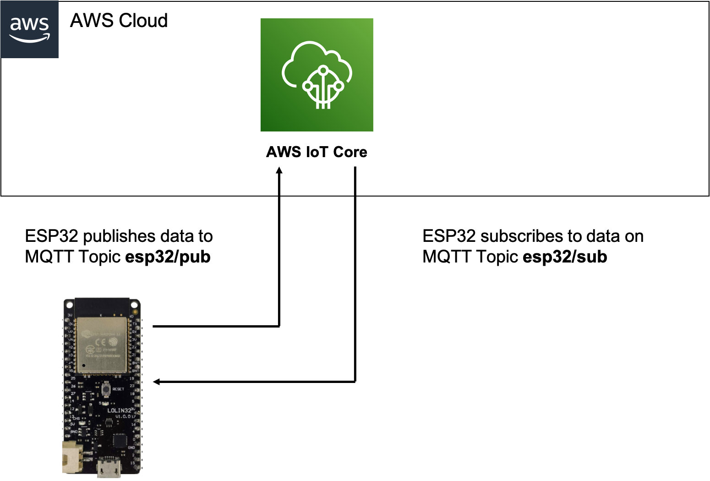
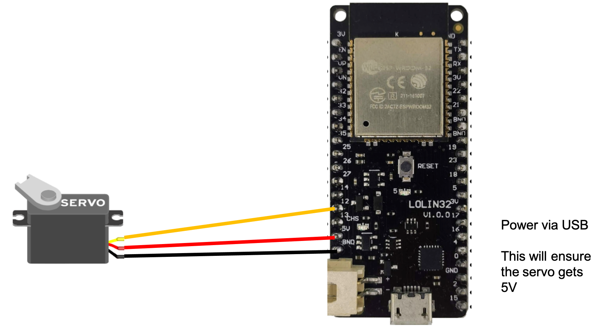

## Connecting ESP32 to AWS IoTCore ##


### Solution overview ### 

To setup an IoT device, in this case the ESP32, to communicate securely with AWS IoTCore, follow the steps shown below. This involves the following steps.

- Create an AWS IoT device in AWS IoTCore. 
- Setup the Arduino IDE for ESP32
- Program the ESP32 with the device code
- Monitor and test ESP32 can send and receive data from IoTCore. 

<br/>



### Step 1  Creating an AWS IoT device ### 


In the AWS IoT Core console, go to Manage -> Things

Choose "Create Things"

Choose "Create a single thing"

Under "Specify thing properties" give the thing a name, for example ESP32-00001. Leave the remaining values set to their default. Click "Next".

Under "Configure device certificate" select "Auto-generate a new certificate" and click "Next".

Under "Attach policies to certificate" select create a new policy. 


Use this JSON for the policy and update REGION and ACCOUNT_ID with your region (example = ap-southeast-2) and your account ID (example = 501XXXXXX449).
Paste this JSON into the policy. 
```json
{
  "Version": "2012-10-17",
  "Statement": [
    {
      "Effect": "Allow",
      "Action": "iot:Connect",
      "Resource": "arn:aws:iot:REGION:ACCOUNT_ID:client/ESP32-00001"
    },
    {
      "Effect": "Allow",
      "Action": "iot:Subscribe",
      "Resource": "arn:aws:iot:REGION:ACCOUNT_ID:topicfilter/esp32/sub"
    },
	{
      "Effect": "Allow",
      "Action": "iot:Receive",
      "Resource": "arn:aws:iot:REGION:ACCOUNT_ID:topic/esp32/sub"
    },
    {
      "Effect": "Allow",
      "Action": "iot:Publish",
      "Resource": "arn:aws:iot:REGION:ACCOUNT_ID:topic/esp32/pub"
    }
  ]
}
```

Click Create Policy

Go back to the "Attach policies to certificate" screen, and select the Policy you just created.

Click "Create Thing"

On the "Download certificates and keys" you must download the certificates. Download and save them somewhere secure, as they will be used when programming the ESP32 device. You will need the Public key file, Private key file and Amazon Root CA 1.

Click "Done"

You will see Under Manage-> Things that the new thing has been created. You will see that it has a Certificate attached. Click on the Certificate and you will see the Policy you created attached. 

Congradulations, the ESP32 device has been provisioned into IoT Core.

### Step 2  Connect Servo to ESP32 (optional) ### 

If you want to connect to lego, you will need a servo motor. The following diagram shows how this is wired up to the ESP32. 
I have used the Wemos Lolin32 dev board, but you can use any ESP32 dev board, just update the arduino program to reflect the pin you use to drive the servo. 



Connect the servo control to GPIO 12. Connect servo positive to 5v output on ESP32 dev board. Connect servo ground to ground on ESP32 dev board. 
This assumes you are powering the dev board via micro usb cable. With batteries the 5V output may not be guaranteed, so you may require additonal circuitry. 
Note: You can leave out the Servo and do something else, for example flash a LED. You only need to update the code in the runRobot() function in the main arduino program file. 

### Step 2  Setup the Arduino IDE for ESP32 ### 


Download the Arduino installer for the desired operating system.

Start Arduino and open the Preferences window.

For Additional Board Manager URLs, add

https://dl.espressif.com/dl/package_esp32_index.json.

Choose Tools, Board, Boards Manager.

Search esp32 and install the latest version by Espressif Systems.

Choose Sketch, Include Library, Manage Libraries.

Search MQTT, and install the latest version by Joel Gaehwiler.
[https://www.arduino.cc/reference/en/libraries/mqtt/](https://github.com/256dpi/arduino-mqtt)


Repeat the library installation process for ArduinoJson.
[https://github.com/bblanchon/ArduinoJson/](https://github.com/bblanchon/ArduinoJson)

If you are using the servo, install this library. Download the zip file and under Sketch-> Include library -> Add .ZIP file. 
https://github.com/madhephaestus/ESP32Servo/tree/master/examples


The Arduino IDE is now installed and configured with all the board definitions and libraries needed for this walkthrough.


###  Step 3  Program the ESP32 with the device code ### 

###  Step 4  Monitor and test ESP32 ### 

