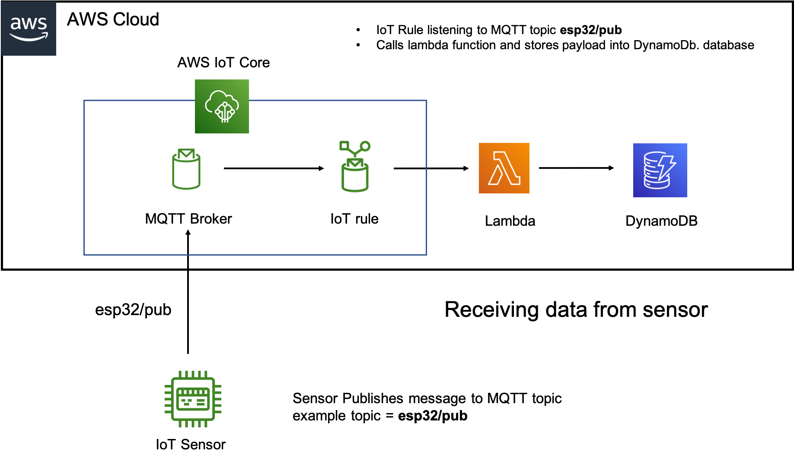
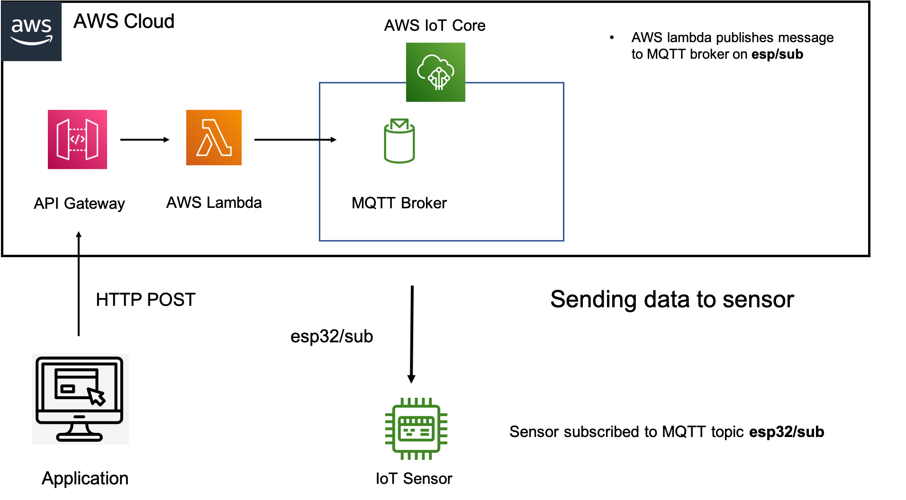
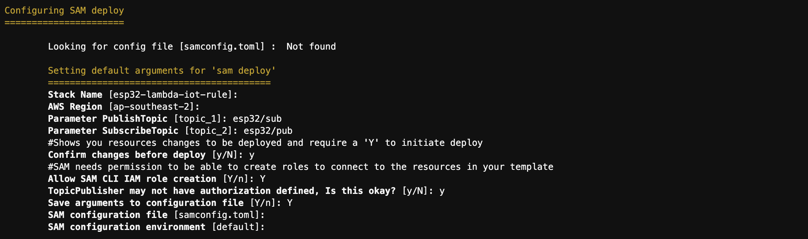
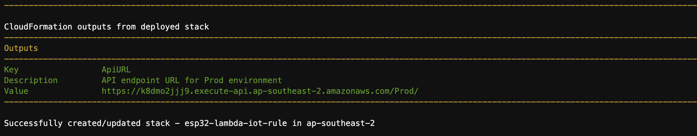
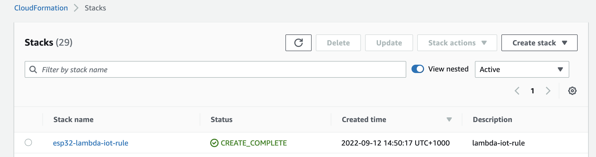
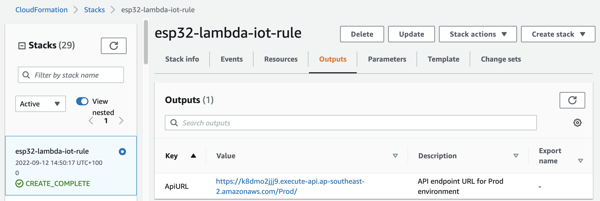

# sam-lambda-iot-rule

Deploy a serverless backend that 

1)  **Receives messages from IoT devices.** IoT device publishes message to an MQTT topic on AWS IoT Core. An IoT Rule will pick up all messages that arrive on this topic. The IoT Rule will call a lambda and pass it the received message. The lambda function will store the sensor data into DynamoDB database. If the ESP32 is publishing messages to topic esp32/pub, then the IoTRule needs to be configured for topic esp32/pub.

2)  **Sends messages to IoT devices.** We need to use REST API (AWS API Gateway) to push a message to a sensor. Using HTTP Post, we first send the message to API Gateway with REST API. API gateway then passes the message to a Lambda function. The Lambda function will write the message to a specified topic on the MQTT message broker. The IoT device is subscribed to this topic, and will pick up the message. For example if the ESP32 is subscribed to topic esp32/sub the AWs IoT Core needs to publish to esp32/sub for the ESP32 to receive the message.

This SAM deployment can be used for many other projects not just this one. 

Here is a summary of the infrastructure that SAM will deploy into AWS. 

First let us exmaine how data is "received" from a device by AWS IoT Core. I.E device is uploading data to AWS. 

<br/>



Now let us examine how data is "sent" to a sensor by AWS IoT Core. I.E device has subscribed to a topic, and AWS IoT Core sends a message to this topic for the device. 




## Services Deployed

* Two AWS Lambda Functions (Described in the next section)
* A DynamoDB table
* An AWS IoT Rule 
* An Amazon API Gateway endpoint


## Project Structure

```bash
.
├── README.MD                   <-- This instructions file
├── src 
│  └── topicPublisher              <-- Source code for a lambda function
│       └── app.js                  <-- Lambda handler to publish messages on an IoT topic stream
│       └── package.json            <-- NodeJS dependencies and scripts
│  └── topicSubscriber
│       └── app.js                  <-- Lambda handler for messages forwarded from the IoT topic stream
│       └── package.json            <-- NodeJS dependencies and scripts
├── template.yaml               <-- SAM template
```


## topicPublisher Lambda function

To send a message to the sensor/device, an application is used to send the message first to the AWS API gateway with REST API. When the API gateway receives the message, it will forward it to this Lambda. The Lambda will then publish the message onto the MQTT broker topic. The device should be subscribed to this topic, and will receive the message. 


## topicSubscriber Lambda function

Devices/sensor will send data to an MQTT topic in AWS IoT Core. Messages landing on this MQTT topic, will tirgger this lambda function. The Lambda function will store the sensor data into DynamoDB database. 

## Parameter Details

* PublishTopic: (Required) Provide a topic to publish on when API gateway receives a message. The default will publish on topic_1. Ensure this reflects the topic that your device has subscrcribed to. 

* SubscribeTopic: (Required) Provide a topic for the IoT rule to query. The default is topic_2. Ensure this reflects the topic that your device is publishing to. 


## How to install 

I am using AWS CLoud 9 IDE as my development environment, it comes with SAM CLI installed. You can use any environment as long as you setup AWS SAM CLI. 
If using Cloud 9 IDE, you can spin it up, do the SAM build and deployment, and then terminate it. 


1) Setup or open an existing Cloud9 IDE terminal. 
2) Download the SAM repository to local environment

```
git clone https://github.com/rorygleeson/aws-transcribe-iotcore

cd aws-transcribe-iotcore/sam-lambda-iot-rule

```

3) Perform the following command to build the SAM artifacts:

```
sam build

```


4) Deploy the SAM template to your AWS account.

```
sam deploy --guided --stack-name esp32-lambda-iot-rule

```

5) For default values type enter. Make sure to set the subsciber and publisher topics to reflect your device code. 
Since my ESP32 publishes to esp32/pub and subscribes to esp32/sub these are reflected as shown below in the SAM deployment input.




6) Please wait few minutes to complete the deployment




7) Go into CloudFormation to verify that the stack was sucesfully deployed into your AWS account




8) Go to the CloudFormation output tab, and get the name of the API gateway end point, ApiURL Tbis is tbe URL used to send data to the device.
Make a note of it as we will need it later. 




* Navigate to [AWS IoT Core](https://console.aws.amazon.com/iot) and click on 'Test'
* Publish a message on the AWS IoT topic set in your query.
* To confirm the function responded to the event, check the CloudWatch logs for the Lambda function or the contents of the DynamoDB table that was generated for this application. 

==============================================
