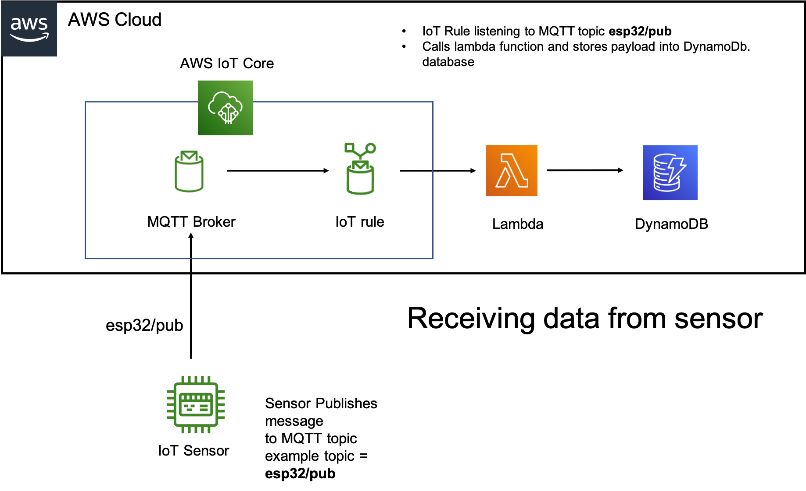

# sam-lambda-iot-rule

Deploy a serverless backend that can both send and receive messages on the AWS IoT MQTT topic stream. 

We can summarise this infrastructure. 

First let us exmaine how data is "received" from a device by AWS IoT Core. I.E device is uploading data to AWS. 

<br/>



Now let us examine has data is sent to the sensor by AWS IoT Core. I.E device has subscribed to a topic, and AWS Core send message to this topic for the device. 


```bash
.
├── README.MD                   <-- This instructions file
├── src 
│  └── topicPublisher              <-- Source code for a lambda function
│       └── app.js                  <-- Lambda handler to publish messages on an IoT topic stream
│       └── package.json            <-- NodeJS dependencies and scripts
│  └── topicSubscriber
│       └── app.js                  <-- Lambda handler for messages forwarded from the IoT topic stream
│       └── package.json            <-- NodeJS dependencies and scripts
├── template.yaml               <-- SAM template
```

## Services Deployed

* Two AWS Lambda Functions (Described in the next section)
* A DynamoDB table
* An AWS IoT Rule 
* An Amazon API Gateway endpoint

## topicPublisher

To send a message to the sensor/device, an application is used to send the message first to the AWS API gateway with REST API. When the API gateway receives the message, it will forward it to this Lambda. The Lambda will then publish the message onto the MQTT broker topic. The device should be subscribed to this topic, and will receive the message. 


## topicSubscriber

Devices/sensor will send data to an MQTT topic in AWS IoT Core. Messages landing on this MQTT topic, will tirgger this lambda function. The Lambda function will store the sensor data into DynamoDB database. 

## Parameter Details

* PublishTopic: (Required) Provide a topic to publish on when API gateway receives a message. The default will publish on topic_1. 
* SubscribeTopic: (Required) Provide a topic for the IoT rule to query. This is the topic that the device is publishing to. The default is topic_2. 


## How to install 

* Navigate to [AWS IoT Core](https://console.aws.amazon.com/iot) and click on 'Test'
* Publish a message on the AWS IoT topic set in your query.
* To confirm the function responded to the event, check the CloudWatch logs for the Lambda function or the contents of the DynamoDB table that was generated for this application. 

==============================================
