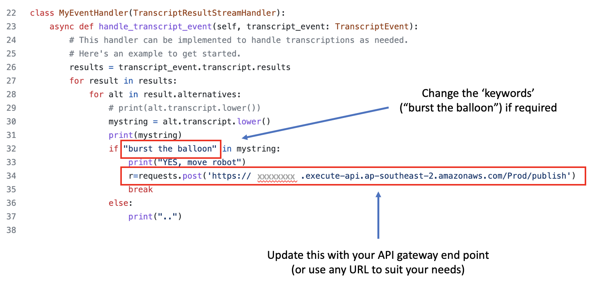
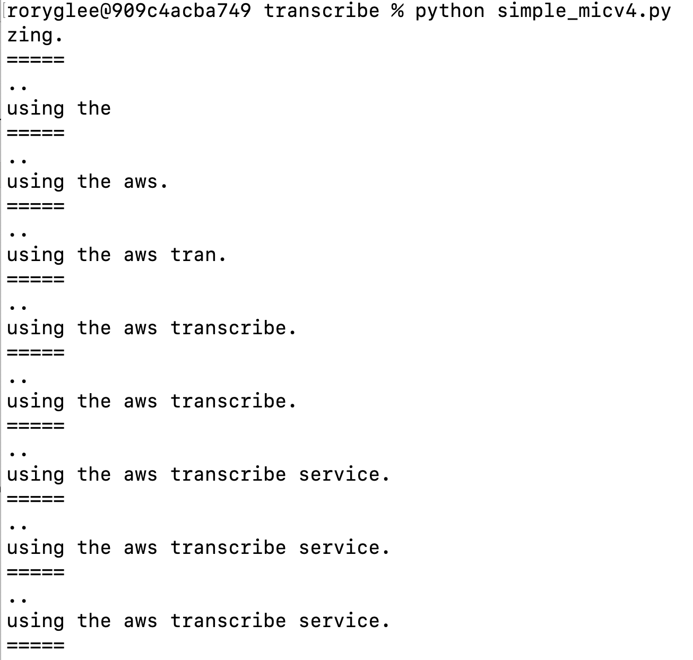
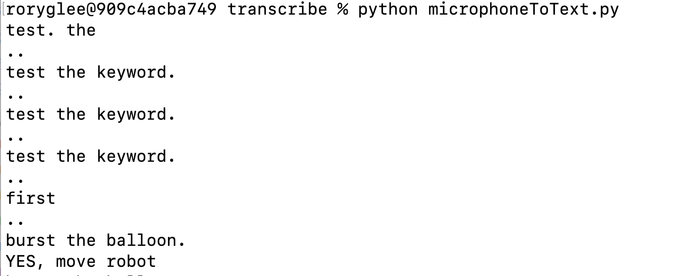

# transcribe-python-app


Simple Python script to do real-time speech to text translation. Talk into microphone, the script will in realtime send the audio to AWS transcribe using the Transcribe API. The audio is converted into text and returned to the script for handling. 

Currtently the script prints all returned text to screen. It examines the returned text looking for the key work that will trigger an action to the ESP32 servo. 

Once it detects the key work has been spoken, it initilises the communication with the ESP32 device by sending a HTTP Post to the API gateway we have deployed by sam-lambda-iot-rule. Feel free to change this to any HTTPS end point to suit your needs. 

Based on this: https://github.com/awslabs/amazon-transcribe-streaming-sdk

## Prerequisites

You will need AWS CLI installed on your laptop. 

Ensure that the AWS CLI is configured with a user that has necessary IAM permissions to access Transcribe. 

I created a user in AWS IAM (with **Programmatic access**), and added the following policy. Configure AWS CLI with this user. 

Here is the user policy. 

```
{
    "Version": "2012-10-17",
    "Statement": [
        {
            "Effect": "Allow",
            "Action": [
                "transcribe:*"
            ],
            "Resource": "*"
        }
    ]
}
```


## Setup

*Note* I have tested this on MacOS and Windows 10. 

### Step 1  ### 


Install AWS Transcribe SDK and necessary python libraries.

Install the AWS Transcribe SDK. 

Install other libraries required. 


```
python -m pip install amazon-transcribe aiofile

python -m pip install sounddevice

python -m pip install requests

```


### Step 2  ### 

Copy the python script from this repository into your environment. 

Update the python script with the HTTP end point you want to POST to when the key word is detected. In this example we are posting a HTTP request to the AWS API Gateway we created in the previous excercise. Update to reflect the API created by SAM.

Update the keyword if required, I am checking for the words "burst the balloon". When I detect that, you will see that the script then calls the API gateway via the HTTP request, which triggers an MQTT message to the IoT device. The IoT device will then perform the necessary action. 
Update the script to suit your requirements, for example you may want to change the key word used to trigger the IoT device action to a different word or phrase. 


<br/>

<br/>


## Test

Run the python script and verify it runs without errors.

Talk into you laptop microphone, verify that your speech is being converted into text and returned to the python script. 

<br/>

<br/>


Say the "Key word(s)" to trigger the action to the IoT device. 
Verify that the python scripts prints the following to screen, indicating it detected the key work. 


<br/>

<br/>


If you have connected a servo motor to your IoT device, verify it moves. 

Verify the IoT device has received the event and performed necessary action. 
You can examine the Arduino Serial monitor to verify this. Or else you can monitor the MQTT topic to which the IoT device has subscribed, and verify the message appears here.  


Congradulations, you have now used AWS Transcribe service, to control an IoT device. 


